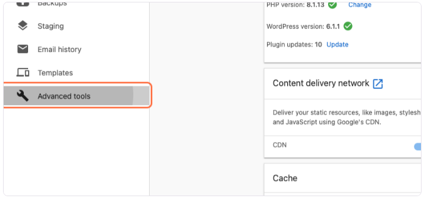
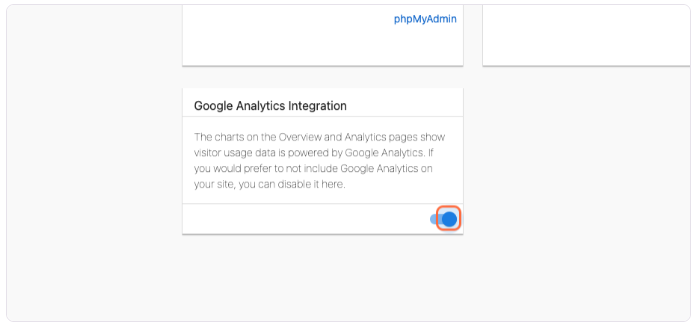
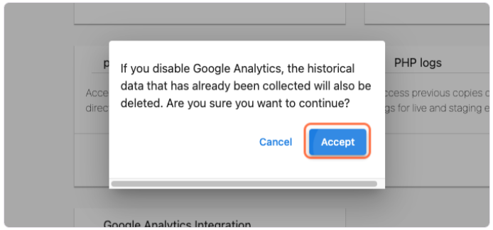

Even though Google has made some efforts to be GDPR compliant with the release of Google Analytics 4 (GA4), it is generally accepted that both Universal Analytics and GA4 are not GDPR compliant with their default settings. To ensure that our partners always have a way to show proof of performance to their clients, all websites that are created with WordPress Hosting come with a default Google Analytics tracking code even if our partners do not add their own Google Analytics account.

### What is it?

To give our partners the option to opt out of the use of Google Analytics in an effort to become GDPR compliant, we have added the option to disable the default Google Analytics functionality. By disabling Google Analytics in WordPress Hosting, the tracking code that typically appears on the DOM of a website will no longer be present. Additionally, we will delete any data stored on our servers that was extracted from Google Analytics and also hide any components on the interface that will no longer function without that stream of data.

If at any time our partners would like to turn Google Analytics back on, the toggle can be switched back on and the tracking code will be added again, data will resume being collected, and the analytics charts will resume functioning normally.

### How to Toggle the Default Google Analytics Tacking On/OFF

1\. Go to your WordPress Hosting dashboard

2\. Click on Advanced tools

3\. Toggle the option for the Google Analytics Integration

4\. Click on Accept

