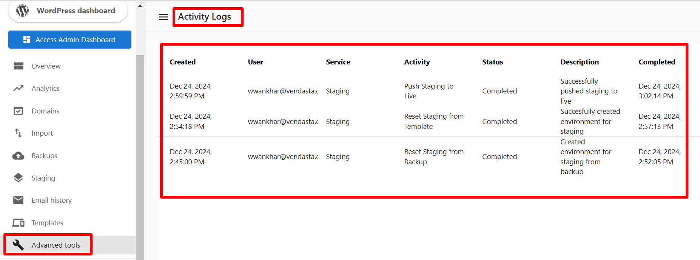

# Activity Logs in WordPress Hosting Pro

The **Activity Logs** feature provides comprehensive tracking of all actions performed on your staging site, enabling better change monitoring and issue troubleshooting.

## Overview

Activity Logs maintain a detailed record of significant staging site activities, allowing you to:

-   Monitor all changes made to your staging environment.
-   Track user actions and system operations.
-   Identify and troubleshoot issues efficiently.
-   Maintain a complete audit trail of staging activities.

## What Activities Are Logged?

The system logs the following critical staging site operations:

-   **Reset Staging from Template**: Records when the staging environment is reset using a new template.
-   **Reset Staging from Backup**: Tracks when the staging environment is restored from a backup.
-   **Push Staging to Live**: Logs when changes are deployed from the staging site to the live production site.

## Understanding the Log Details

Each activity log entry contains the following details for a complete overview:

| Field       | Description                                                  |
|-------------|--------------------------------------------------------------|
| **Created** | The date and time when the activity was initiated.           |
| **User** | The user account that performed the action.                  |
| **Service** | The specific service or feature associated with the action.  |
| **Activity** | The type of operation performed (e.g., Push Staging to Live).|
| **Status** | The current state of the activity (Completed, Failed, etc.). |
| **Description**| A brief explanation of the action performed.                 |
| **Completed** | The date and time when the activity finished.                |

 

## How to Access Activity Logs

Follow these steps to view your activity logs:

1.  Log in to your WordPress Hosting Pro dashboard.
2.  Navigate to the **Advanced Tools** section.
3.  Select **Activity Logs** from the menu.
4.  Review the detailed records of all staging site activities.

 

## Common Use Cases

-   **Change Monitoring**: Track all modifications made to your staging environment before deploying to production, ensuring you know what changes are going live.
-   **Troubleshooting**: Quickly identify the root cause of issues by reviewing the sequence of actions performed on the staging site.
-   **Audit Compliance**: Maintain a complete, chronological history of staging activities for compliance, security reviews, and reporting purposes.