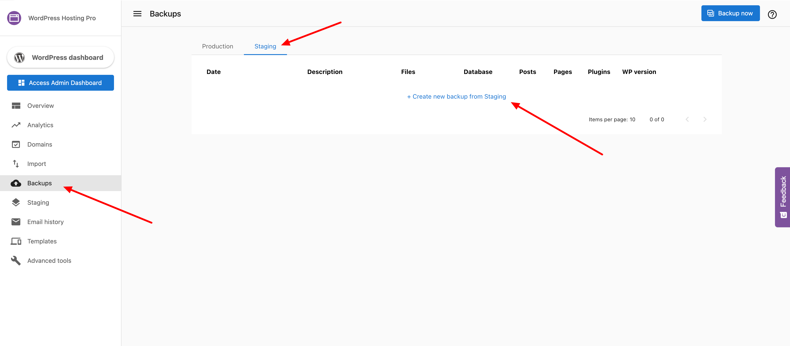

# Managing and Creating Website Backups

Protecting your website is crucial, and our hosting dashboard provides a powerful backup system to ensure your digital assets are always safe. This guide covers how our automated and manual backups work, how long we keep them, and how you can create a new backup in just a few clicks.

---

## How Backups Work: Automated vs. Manual

Our platform offers a dual-layered backup system for complete peace of mind, combining automated daily backups with the flexibility of on-demand manual backups.

### Automated Daily Backups 🛡️

Every day, our system **automatically creates a backup of your live website**. This ensures that your latest content, updates, and changes are safeguarded without you needing to do anything.

### Manual On-Demand Backups  fleksibel

For moments when you need an immediate backup—like right before a major update or theme change—you can generate a backup at any time. This gives you an extra layer of control and ensures you always have a recent recovery point.

---

## Backup Retention Policy

We store your backups for a set period based on your hosting plan.

-   **WordPress Hosting Pro Accounts**: Backups are retained for **60 days**, offering an extensive history for comprehensive project tracking and recovery.
-   **WordPress Hosting Standard Accounts**: Backups are retained for **1 day**, providing an essential safeguard for your site.

---

## Important Note: Staging vs. Live Site Backups

It is critical to understand the difference in how backups are handled for your live (production) and staging sites.

-   **Live Sites**: Receive **automated daily backups**.
-   **Staging Sites**: **Do NOT receive automated backups**. You must create backups for your staging site manually.

### How to Back Up Your Staging Site

To back up your staging environment, navigate to the **Backups** tab, switch to the **Staging** view, and click **Create new backup for staging**.

---

## How to Create a Manual Backup

Creating a new backup of your live site is simple and can be done at any time from the **Backups** tab in your dashboard.

1.  From your site dashboard, click on the **Backups** tab.
2.  In the **Production** backups view, you will see a button to create a new backup.
3.  Click **Create a new backup from Production** (or **Backup Now**) to start the process.

  

The system will immediately begin capturing the current state of your live site, ensuring all your recent changes are securely saved. Once complete, the new backup will appear in your list of available recovery points.
