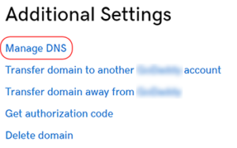

# How to point a New GoDaddy domain to Website Pro
If you recently purchased the domain (or just have never pointed your domain to a site), then these instructions should allow you to point your domain to your Website Pro site. These less specific [Domain connection Instructions](./connect-custom-domain.md) might be more helpful if your [DNS records](./what-are-dns-records.md) are not managed in GoDaddy. Follow these [transfer domain instructions](./existing-godaddy-domain.md) if you are transfering your domain from a previous host.

* * *

Part 1: Editing your DNS settings on GoDaddy
--------------------------------------------

1.  On GoDaddy, go to Domains > All Domains
2.  Select your domain name from the list to access the **Domain Settings** page
3.  Scroll down to **Additional Settings** and select **Manage DNS**

4.  On the **DNS Management** page, find the **Records** section (shown below)
5.  For your bare domain (like “example.com”) which has a “**Name”** of **“@”**, create an “**A**” record and the value should be **_34.149.86.124_**
6.  For a subdomain (like “www.example.com”) which has a “**Name**” of “**www**“, create a “**CNAME**” record and the value should be **_host.websiteprohosting.com_**
7.  Click **Save** to complete the process
8.  To encourage the DNS system on the internet to update quickly you can flush Google’s DNS cache using their [Google Public DNS Flush Cache](https://developers.google.com/speed/public-dns/cache) tool.
9.  Allow up to 24 hours for all changes to take full effect. During this time your old host may still be serving your site’s traffic. You can check on the status of your DNS Settings using tools like [MxToolbox DNS Lookup](https://mxtoolbox.com/DNSLookup.aspx) or viewing the **Domains** tab in **Website Pro.**

Part 2: Configuring your Website Pro Site
-----------------------------------------

1.  Log into Website Pro and navigate to the **Domains** tab
2.  Click **Connect a Domain**
3.  Enter the domain name you purchased. Click **Add Domain.**
4.  Your domain will show up in the table and it will be marked **p****ending** while Website Pro gets ready to handle requests on that domain. This should take a minute.
5.  When it can handle requests on that domain it might appear **disconnected** because Website Pro cannot detect the correct DNS records yet. Once your DNS Records have completely propagated through the DNS system it should appear **connected**.
    *   It is also normal for your SSL Certificate to be **pending** at this point. It may take several minutes to obtain an SSL Certificate. If you can’t wait for the SSL Certificate you can expand **Advanced Settings** and disable **Redirect to HTTPS** temporarily. _It is very important to re-enable this setting_ because serving traffic on **HTTPS** is much safer and it improves your site’s ranking in Search Engines.
6.  Click **Make Primary** on the domain that you want all your visitors to be redirected to.
7.  If you disabled **Redirect to HTTPS** temporarily in step 5 you should check this **Domains** tab frequently until the SSL Certificate is marked **secure**. As soon as you can you should enable **Redirect to HTTPS.**