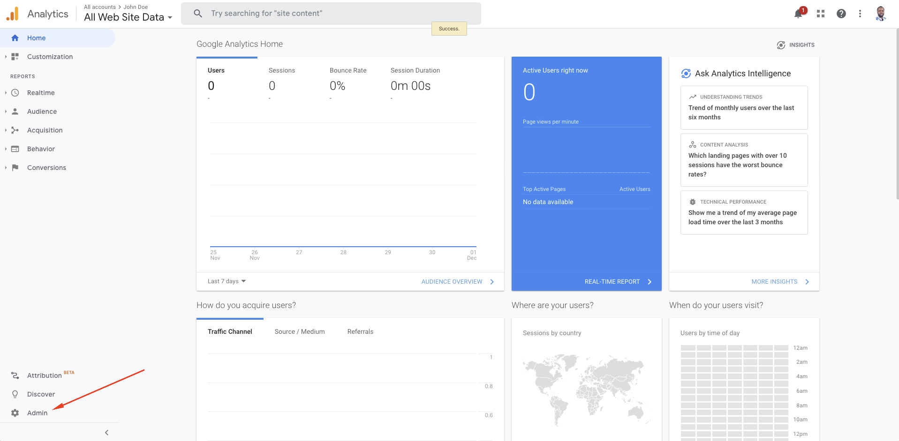
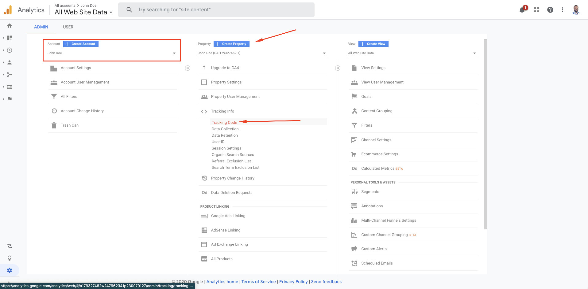

WordPress Hosting Pro and WordPress Hosting Standard provide built-in insights and support external tools like Google Analytics and Search Console. This article covers how to add analytics tracking, understand bounce rates, and confirm whether your site is indexed by Google.

#### **Q: How do I add my Google Analytics account to WordPress Hosting Pro?**

There are two ways to install Google Analytics in WordPress Hosting Pro: using the built-in settings or by manually injecting the tracking code.

**Method 1: Use the Tracking ID field in Settings**

1.  Sign in to your [Google Analytics account](https://analytics.google.com/). 
    
2.  Navigate to:  
    **Admin > Property Settings > Tracking Info > Tracking Code ** 
    
3.  Copy your **Tracking ID** (format: `UA-XXXXXXX-X` or `G-XXXXXXX`)    
    
4.  In your WordPress dashboard (WordPress Hosting Pro):
    
    *   Go to **Settings > General ** 
        
    *   Scroll to the bottom and paste your Tracking ID into the **Custom Google Analytics Tracking ID** field
        
    *   Click **Save Changes**
        

To ensure accurate data syncing, also verify that Google Analytics is connected in:

> **Business App > Administration > Connections**

**Method 2: Add the script manually in Divi**

1.  In your WordPress dashboard, go to **Divi > Theme Options**
    
2.  Paste your Google Analytics `gtag.js` script into the **Body Code** section
    
3.  Save changes
    

This ensures the script loads on all pages across your site.

#### **Q: Why is my bounce rate lower than expected in Google Analytics?**

While this article doesn’t yet exist as a formal Help Center entry, here are the likely reasons:

*   **Very low bounce rates** (e.g., under 10%) usually indicate a **technical issue**, such as:
    
    *   Duplicate Google Analytics tracking (e.g., from both a plugin and hardcoded script)
        
    *   Event-based tracking falsely counting interactions
        
    *   Improper tag placement in your theme or plugin
        

Use the **Google Tag Assistant Chrome Extension** to inspect your tags and verify correct implementation:  
[Google Tag Assistant Tutorial](https://www.analyticsmania.com/post/google-tag-assistant-tutorial/)

If needed, clean up duplicates by:

*   Disabling redundant plugins
    
*   Removing extra manual script embeds
    
*   Reviewing tag behavior in Google Tag Manager
    

#### **Q: How do I check if my website is indexed by Google?**

Google Search Console is the best tool to verify and manage site indexing.

**Step 1: Submit your domain**

1.  Go to [Google Search Console](https://search.google.com/search-console/)
    
2.  Choose **"URL Prefix"** or **"Domain"** setup
    
    *   `URL Prefix`: Requires only access to your site (e.g., via tracking tag)
        
    *   `Domain`: Requires access to your domain registrar (to add a TXT DNS record)
        
3.  Verify domain ownership through the guided steps
    

> _Note: DNS changes can take 6–12 hours to propagate._

<!-- image removed: ./img/32137920258839-84ca195be6.png -->

**Step 2: Submit your XML sitemap**

After verification, submit your XML sitemap to help Google crawl your site.

To find your sitemap:

*   **Yoast SEO**: Log in to WordPress > SEO > General > Features tab  
    [Yoast Sitemap Help](https://yoast.com/help/xml-sitemaps-in-the-wordpress-seo-plugin/)
    
*   **Rank Math SEO**:  
    [Rank Math Sitemap Video Tutorial](https://www.youtube.com/watch?v=bK2DHBhUUOo)  
    <!-- image removed: ./img/32137920258839-698ca7cfb9 -->
    

Submit the sitemap under the **Sitemaps** tab in Search Console.  
            <!-- image removed: ./img/32137920258839-0029085f4f -->

**Step 3: Manually request page indexing**

*   In the GSC dashboard, click the **URL Inspection** tool
    
*   Paste in the URL you want indexed
    
*   If it says "URL is not on Google," click **Request Indexing**
    
    <!-- image removed: ./img/32137920258839-45e804b487 -->
    

> Crawling and indexing can take **7–15 days** to reflect in search results.
