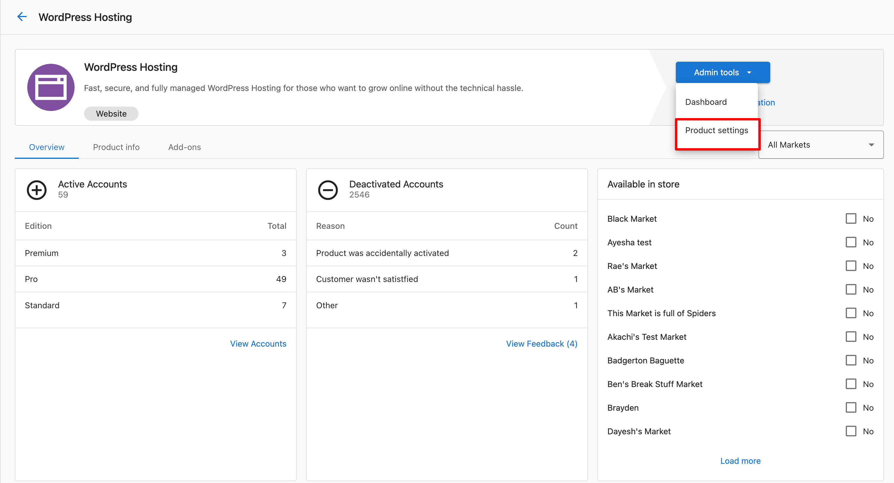
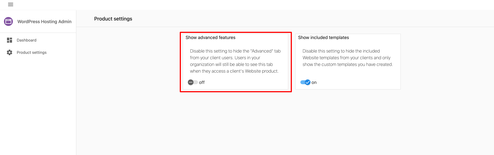

This FAQ covers how Partner admins can control what features users see in the WordPress Hosting Pro dashboard, and answers common questions about access to tools like SFTP, cPanel, and admin panels.

### Q: How can I hide the Advanced Tools tab from clients?

Partner admin users can remove the **Advanced Tools** tab from the WordPress Hosting dashboard for all client accounts.

This prevents clients from accessing:

*   phpMyAdmin
    
*   SFTP
    
*   PHP logs
    
*   Advanced WordPress login option
    

**To disable it:**

1.  Go to **Partner Center > Marketplace > Products > WordPress Hosting**
    
2.  Click the **Product Info** tab
    
3.  Go to **Admin tools > Product Settings ** 
    
4.  Toggle off **Show Advanced Features ** 
    

> This change applies **globally** across all accounts and cannot be customized per client.

Partner admins will still be able to see and use all advanced tools.

### Q: Do I get access to cPanel when hosting on WordPress Hosting Pro?

No — **[cPanel](https://cpanel.net/) is not used** with WordPress Hosting Pro.

WordPress Hosting Pro is a fully managed hosting environment built on Google Cloud infrastructure. It handles traditional cPanel features internally, including:

*   Domain management
    
*   Backups and restores
    
*   SSL provisioning
    

If you need direct technical access, you can use:

*   **phpMyAdmin** for database management
    
*   **SFTP** (with a key file) for accessing your file system
    

### Q: Can I log in to WordPress Hosting Pro SFTP with a username and password?

No. WordPress Hosting Pro does **not support password-based SFTP access**.

To connect over SFTP, you must:

*   Generate a **key file** from the WordPress Hosting Pro dashboard
    
*   Use an SFTP client like FileZilla with your username and key file
    

> For setup steps, see: **[How to use SFTP to access the file system](https://support.vendasta.com/hc/en-us/articles/32162294727063-FAQ-Admin-Access-Feature-Visibility-Control-in-WordPress-Hosting-Pro#)** (insert link)
