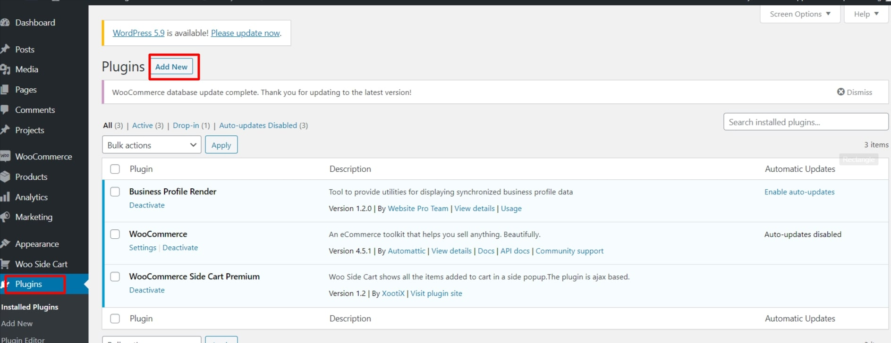
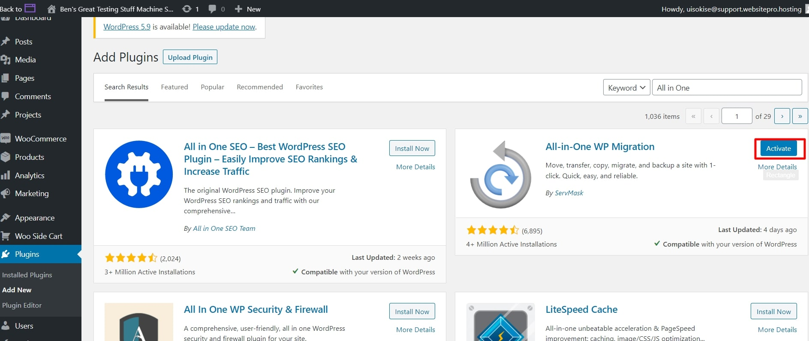
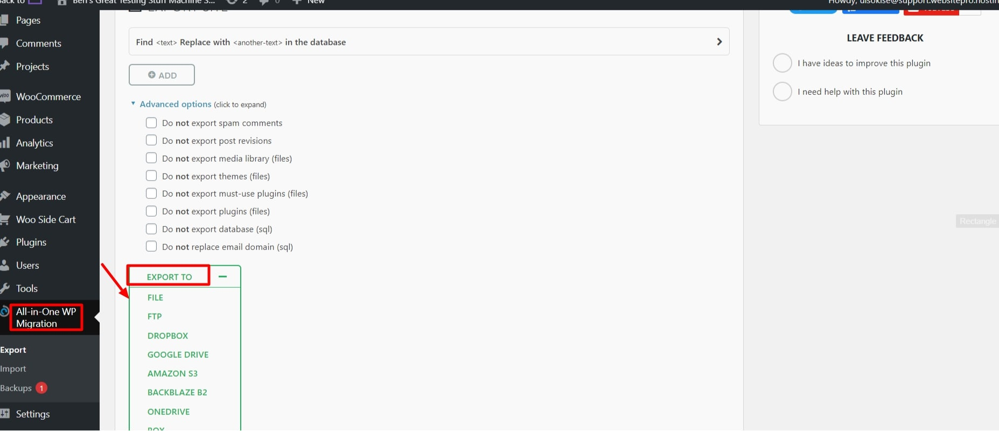

This FAQ covers how WordPress Hosting Pro handles email communications, SPF requirements, and common issues after site migration.

### Q: Does WordPress Hosting Pro require an SPF record?

No, an SPF record is **not required** to connect or launch a site with WordPress Hosting Pro.

The only DNS records you need are:

*   **A Record**
    
    *   Name: `@` or your domain name
        
    *   Value: `34.149.86.124`
        
*   **CNAME Record**
    
    *   Name: `www`
        
    *   Value: `host.websiteprohosting.com`
        

> DNS changes may cause brief downtime during propagation.

If you're sending emails using your own custom domain, and want to improve deliverability, you may optionally configure SPF, DKIM, and DMARC records, but WordPress Hosting Pro does not require them by default.

### Q: Why are emails bouncing after I migrated my website?

This is often due to missing email domain settings during the migration process.

**To fix:**

1.  Go to your site’s **WordPress Dashboard** in WordPress Hosting Pro
    
2.  Navigate to **Plugins > Add New ** 
    
3.  Search for and install **All-in-One WP Migration ** 
    
4.  After activation, go to the plugin’s menu and choose **Export > Advanced Options   
    ** 
    
5.  Make sure to select **"Do not replace email domain (SQL)"**
    

This prevents the migration tool from incorrectly rewriting email addresses which is a common cause of bounced messages after import.

> Bonus Tip: If needed, you can export your site manually using the **File** option in the plugin to keep a local copy.  
> 
