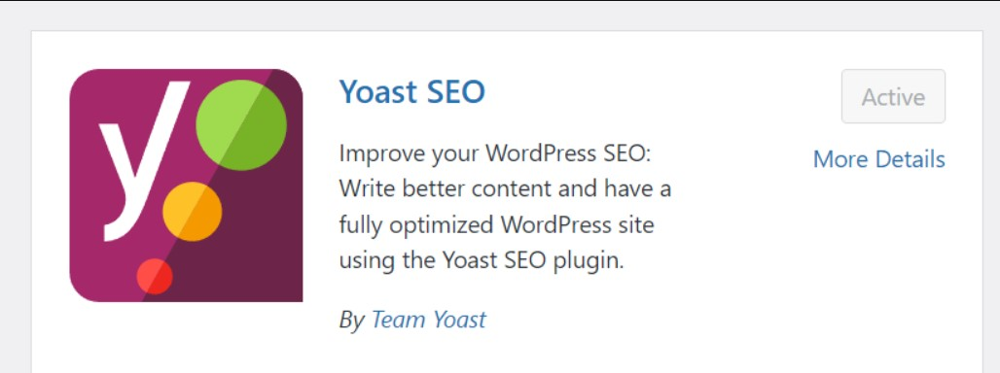
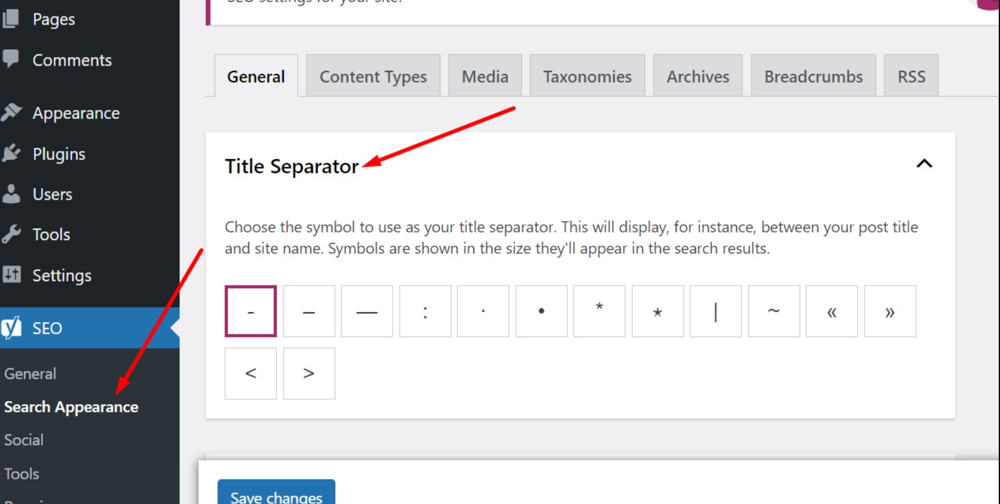

This FAQ covers small but powerful ways to customize your website’s appearance and user experience — from popups and ADA tools to SEO settings and builder visibility.

### Q: How do I add an ADA compliance widget to a WordPress Hosting Pro site?

To add an ADA widget (like One Click Accessibility), follow these steps:

1.  Log in to the **WordPress dashboard** of your client’s site
    
2.  Navigate to **Plugins > Add New**
    
3.  Search for and install the plugin called **“One Click Accessibility”**
    
4.  Activate the plugin
    
5.  Configure the accessibility toolbar from the plugin’s settings
    

This plugin makes your website more inclusive by providing accessibility tools like font resizing, contrast toggles, and keyboard navigation.

### Q: How do I change the title separator icon in WordPress?

You can customize your site’s title separator using the **Yoast SEO plugin**:

1.  Install and activate **Yoast SEO** (via Plugins > Add New)  
    
2.  In your WordPress dashboard, go to **Yoast SEO > Search Appearance ** 
    
3.  Under the **General** tab, choose your preferred separator (e.g., dash, pipe, or bullet)
    
4.  Click **Save changes ** 
    

This affects how titles appear in browser tabs and search engines.

### Q: Does WordPress Hosting Pro support PHP short tags (`<?`) in code?

No. WordPress Hosting Pro does not support **short open tags (`<?`)** for PHP code.

These tags were deprecated in PHP 7.0 and can conflict with other file types (like XML). Instead, always use the full tag format:

```php
<?php // your PHP code here ?>
```

If you're working on a site that currently uses short tags, use a tool like **Notepad++** to perform a find-and-replace and convert them to the proper format.

### Q: Why can’t I see the Divi Builder in my WordPress dashboard?

The **Divi Builder** only appears when your site is using a theme that supports it.

When selecting a theme in WordPress Hosting Pro or WordPress Hosting Standard:

*   Look for the **yellow star icon** in the top-right corner — that indicates Divi compatibility
    
*   If the Divi Builder isn’t appearing, try switching to a supported theme
    

Once active, Divi’s Visual Builder will be accessible from the WordPress dashboard and during page editing.


### Q: How do I create a popup using Divi Builder?

Here’s how to set up a popup using a plugin-compatible version of Divi:

1.  Log into the **WordPress Dashboard**
    
2.  Install the **Divi Popup** plugin
    
3.  Open your site and **enable the Visual Builder**
    
4.  Add a **Button module** to your page
    
    *   Set the link as: `#popupname` (e.g., `#hello`)
        
5.  Create a new section with your popup content (e.g., text, images)
    
6.  Open the section settings and:
    
    *   Enable **“This is a Popup”**
        
    *   Set the **Popup ID** to match your button link (e.g., `hello`)
        
7.  Save your changes (`Ctrl + S`)
    

> Be sure to use **lowercase letters** for your Popup ID to avoid triggering errors.
