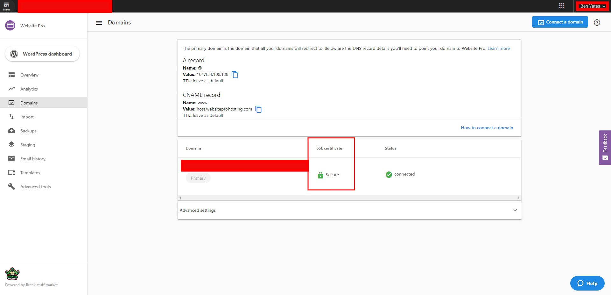

All WordPress Hosting sites are automatically provisioned a [LetsEncrypt](https://letsencrypt.org/about/) SSL certificate, so you do not need to follow any extra steps to set this up. Please allow up to 24 hours for the SSL certificate to populate.

