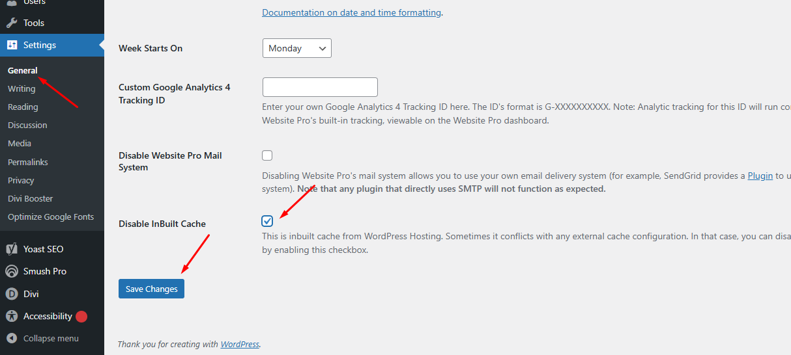

# How the Disable Inbuilt Cache Plugin Works

This article explains the functionality of the **Disable Inbuilt Cache** plugin. Understanding how it operates can help you diagnose caching-related issues, recognize when to use it, and resolve conflicts with other caching plugins.

## When to Use This Plugin

The primary purpose of this plugin is to prevent conflicts between the hosting platform's built-in server cache and other third-party caching plugins you might install (e.g., **W3 Total Cache**, **WP Rocket**, **LiteSpeed Cache**).

Sometimes, having multiple layers of caching can cause unexpected behavior, such as changes not appearing on your live site. By enabling this option, you are telling the hosting server **not** to cache your pages, giving your installed caching plugin full control.

---

## How to Enable the Plugin

Enabling the feature involves a single checkbox in your WordPress dashboard.

1.  Log in to your WordPress admin dashboard.
2.  Navigate to **Settings** > **General** from the left-hand menu.
3.  Scroll to the bottom of the page to find the **Disable Inbuilt Cache** option.
4.  Check the box next to "Disable our inbuilt cache."

     

5.  Click **Save Changes**.

Once saved, the plugin will begin telling the server to bypass its cache for all future page loads.

---

## Caches That Are NOT Affected

This plugin is highly specific and only affects the server-side cache provided by your host. It has **no effect** on other common caching mechanisms.

The following caches are **unaffected**:

-   **WordPress Object Cache**: This is a powerful system that stores the results of complex database queries in memory (using tools like **Redis** or **Memcached**) to speed up the backend processing of your site. This plugin does not interfere with it.
-   **WordPress Transients API**: A method used by plugins and themes to temporarily store data in the WordPress database for better performance. This is also unaffected.
-   **Browser Cache**: The cache stored on a visitor's own computer. This is controlled by different headers like `Cache-Control` or `Expires`, which this plugin does not modify. Your site will still load quickly for repeat visitors.
-   **Third-Party Plugin Caches**: Caching features built into other plugins you've installed (e.g., **W3 Total Cache**, **WP Rocket**) are not disabled by this tool. This plugin is designed to *help* those plugins work correctly without interference from the server cache.