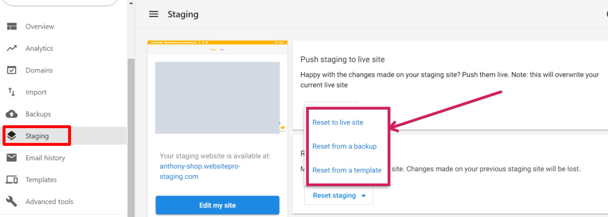

WordPress Hosting Pro provides three flexible options for resetting your staging environment, allowing you to tailor it to your needs.  
  

### 1\. Reset to Live Site

This option creates an **exact copy** of your current live site in the staging environment.

*   Best for testing updates or changes based on your live website's most recent state.

### 2\. Reset from Backup

Select this option to reset the staging site using a backup from your **backup list**.

*   Ideal for comparing your current live site to an earlier version or recovering content from a previous state.

### 3\. Reset from Template

Use this option to install a **fresh template** on your staging site.

*   Perfect for experimenting with new designs or starting with a blank canvas.
*   This setup will differ from your live site, allowing you to explore creative changes without affecting the production environment.
