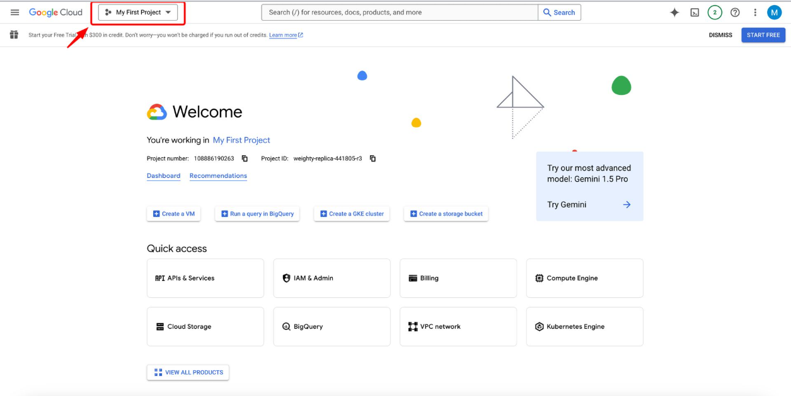
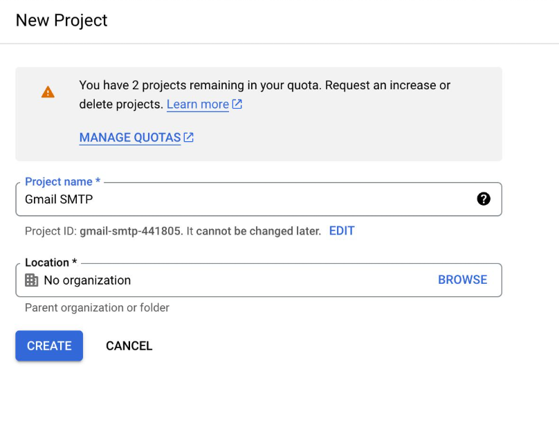
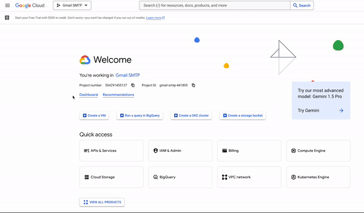
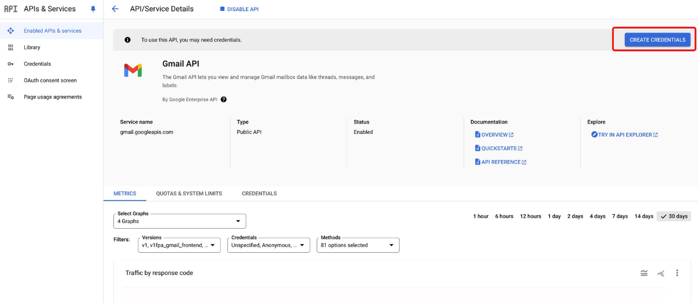
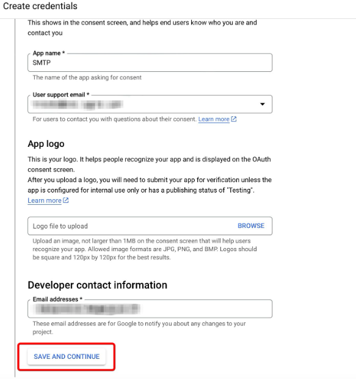
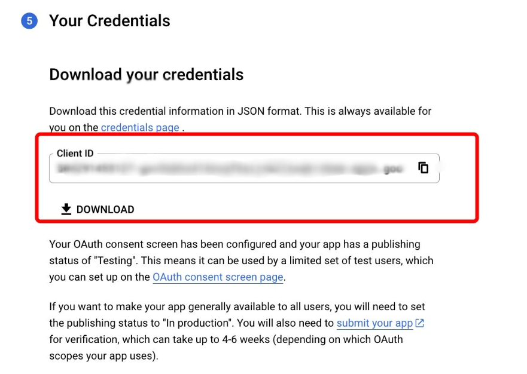
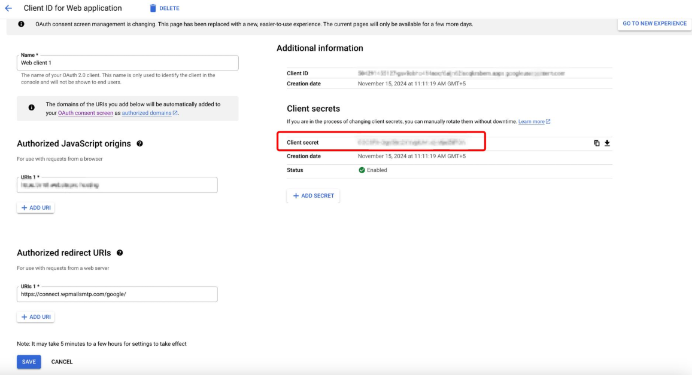
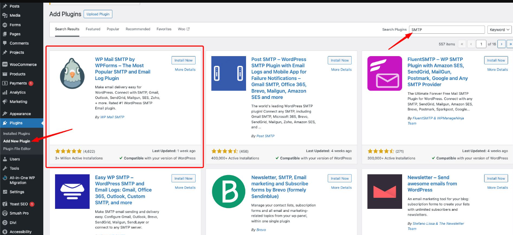
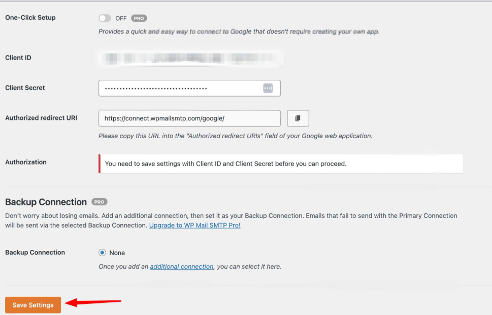
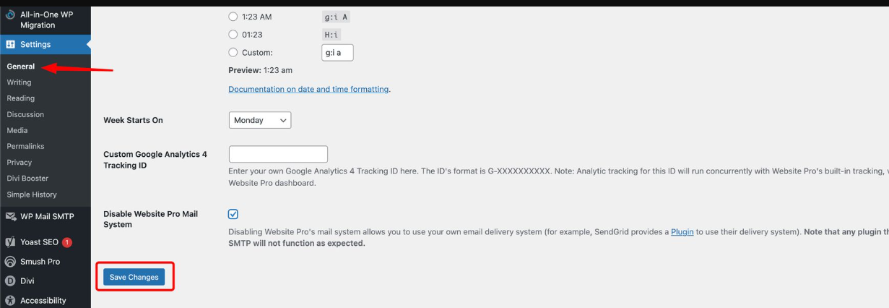

This article walks you through setting up Gmail SMTP for your WordPress website using the **WP Mail SMTP** plugin and **Google Cloud Console**. This configuration allows you to send emails securely via Gmail instead of relying on your hosting server.

### Prerequisites

*   A Gmail or Google Workspace account
    
*   Admin access to your WordPress site
    
*   Access to Google Cloud Console
    

### Step 1: Create a Project in Google Cloud

1.  Go to [Google Cloud Console](https://console.cloud.google.com/).
    
2.  Log in with your Google account.
    
3.  Click **Create Project**, name it (e.g., **Gmail SMTP**), and click **Create**.  
      
    
    

### Step 2: Enable the Gmail API

1.  In the Google Cloud Console, navigate to **APIs & Services > Library**.
    
2.  Search for **Gmail API**, click it, and then click **Enable**.
    
3.  Click **Create Credentials** to begin setting up your OAuth access  
      
      
    4\. Click **Create** **Credentials** to Generate Client ID.  
    
    

### Step 3: Set Up OAuth Consent Screen & Credentials

1.  Go to **Credentials > OAuth consent screen**.
    
2.  Choose **User Type** as **External**, then click **Create**.  
      
      
      
    
    3\. Fill in:
    
    *   **App name**: SMTP
        
    *   **User support email**: Your Gmail address
        
        1.  Click **Create** and copy both the **Client ID** and **Client Secret**.**Developer contact email**: Your Gmail address  
              
            
            
            4\. Skip scopes and click **Save and Continue**.
            
    *   5\. Under **Credentials**, click **Create Credentials > OAuth Client ID**.
        
        *   **Application type**: Web application
            
        *   **Name**: Web Client 1 (or your choice)
            
        *   **Authorized JavaScript origins**: `https://yourdomain.com`
            
        *   **Authorized redirect URI**: `[https://connect.wpmailsmtp.com/google](https://connect.wpmailsmtp.com/google)``   `
            
            ### **  
              
              
              
              
            **Step 4: Publish the App
            
            1.  Go back to **OAuth Consent Screen**.
                
            2.  Click **Publish App** to switch from testing to production mode.
                
            
            ### _Note: Testing mode limits usage to 100 users. Publishing removes this limit.  
              
            _Step 5: Configure WP Mail SMTP Plugin
            
            **Install the Plugin**
            
            1.  Go to your WordPress dashboard.
                
            2.  Navigate to **Plugins > Add New**.
                
            3.  Search for **WP Mail SMTP**, install, and activate it.  
                  
                  
                  
                
                **Configure the Plugin**
                
                1.  Go to **WP Mail SMTP > Settings**.
                    
                2.  Fill in:
                    
                    *   **From Email**: Your Gmail address
                        
                    *   **Force From Email**: Enabled
                        
                    *   **From Name**: e.g., "Test Email"
                        
                    *   **Mailer**: Google
                        
                3.  Paste your **Client ID** and **Client Secret** from Google Cloud.
                    
                4.  Save the settings.  
                      
                    
                    
            
             **Authorize Gmail**
            
            1.  Click **Allow plugin to send emails using Google**.
                
            2.  Log in to your Google account and grant permissions.
                
            3.  If prompted with a warning, click **Advanced > Go to WP Mail SMTP** and continue.
                
            4.  You’ll be redirected back to your site once authorization is complete.  
                  
                  
                  
                
                
                ### Step 6: Disable WordPress Hosting Pro Mail System
                
                1.  In your WordPress dashboard, go to **Settings > General**.
                    
                2.  Disable the **WordPress Hosting Pro Mail System** to allow WP Mail SMTP to take over.
                    
                    ### Step 7: Test the Configuration
                    
                    1.  Install the **WP Mail SMTP Email Test** plugin (if not included).
                        
                    2.  Go to **WP Mail SMTP > Tools > Email Test**.
                        
                    3.  Send a test email.
                        
                    4.  Look for the message: _“Email has been sent!”_
                        
                    5.  Check your inbox to confirm delivery.
                        
                    
                    You’ve now configured Gmail SMTP on your WordPress website. This setup improves deliverability and ensures your site uses Gmail’s secure and reliable email service.
