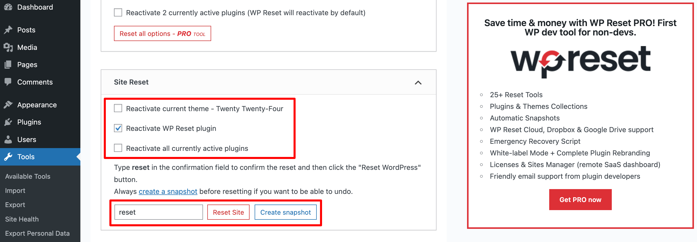

Resetting your WordPress site is quick and easy with the WP Reset plugin. Follow these steps to get a clean slate:

1.  **Install the Plugin**:  
    Go to your WordPress dashboard, navigate to **Plugins > Add New**, search for “WP Reset,” and install and activate the plugin.
2.  **Access WP Reset Tools**:
    1.  In the dashboard, go to **Tools > WP Reset**.  
3.  **Reset the Site**:

Scroll to the reset section, type “reset” in the confirmation box, and click **Reset Site**.  
  

That’s it! Your site will be reset to a fresh WordPress installation, ready for new configurations.
