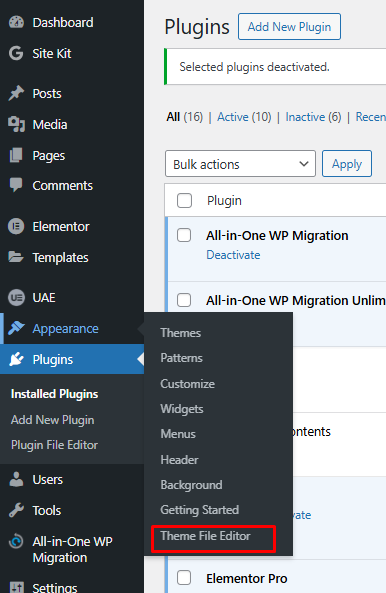
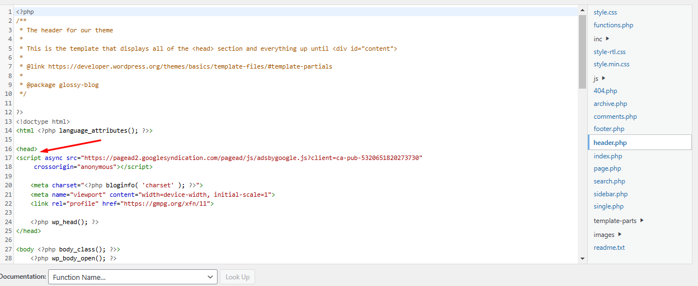

Adding a Google Tag or AdSense code to your WordPress site is a straightforward process. Follow these steps to ensure the code is correctly integrated into your website.

### Step 1: Sign In to Your WordPress Backend

1.  Go to your WordPress login page.
    
2.  Enter your credentials and sign in to access the WordPress dashboard.
    

### Step 2: Access the Theme File Editor

1.  In the menu on the left, click **Appearance**.
    
2.  From the dropdown menu, select **Theme File Editor**.
    

### Step 3: Locate the Header File

*   In the right-hand panel of the Theme File Editor, look for the **Theme Header (header.php)** file.
    
*   Note: The file name might differ depending on your theme. For example, if you’re using the “WordPress Twenty Twenty-One” theme, the header file is named **header.php**.
    
*   Open the header file and confirm that it contains a `<head>` tag.
    

### Step 4: Add the Google Tag/AdSense Code

1.  Copy the Google Tag/AdSense code snippet from your Google account.
    
2.  Paste the code snippet within the `<head>` tag in the header file.
    
3.  Click **Update File** to save your changes.
    

### 

### Important Notes

*   **Theme Changes:** If you change your WordPress theme, the **header.php** file might be overwritten. In such cases, you’ll need to repeat the above process to re-add the code to the new theme’s header file.
    
*   **Backup:** Before making changes to your theme files, it’s a good idea to back up your website to prevent accidental data loss.
    

By following these steps, you can successfully integrate Google Tag or AdSense code into your WordPress site.
